<br>
<!-- <p style="color:#0FA3B1;">Don't explicitly put title on cover page 🥳 </p>
<p style="color:#0FA3B1;">Put your own logo somewhere </p> -->

 </img>

<style scoped>
#ATLAS {
  width: 180px;
  position: absolute;
  right: 3%;
  bottom: 4%;
  /* background-color: #2B90B6;
  background-image: linear-gradient(45deg, #4EC5D4 15%, #146b8c 50%); */
}
</style>


---
layout: two-cols
layoutClass: gap-16
---

# Table of contents

You can use the `Toc` component to generate a table of contents for your slides:

```html
<Toc minDepth="1" maxDepth="1"></Toc>
```

The title will be inferred from your slide content, or you can override it with `title` and `level` in your frontmatter.

::right::

<Toc v-click minDepth="1" maxDepth="2"></Toc>

---
layout: pageBar
title: "Introducción"
---

# Introducción
EEG y su uso en la localización de fuentes de actividad neuronal. blah blah

<div class="grid grid-cols-2 gap-5 items-center justify-center">

<div class="col-span-1">

$$
	V(r) = \frac{2\sigma_{0}}{\sigma_{k}^{-} + {\sigma_{k}^{+}}} V_{0}(r) + \frac{1}{2\pi} \sum_{j=1}^{R}\frac{\sigma_{j}^{-}-\sigma_{j}^{+}}{\sigma_{k}^{-}+\sigma_{k}^{+}} \int_{r'\varepsilon S_{j}} V(r') \frac{r'-r}{||r'-r||^3}\partial S_{j}
$$


El EEG es una técnica no invasiva que permite medir la actividad eléctrica del cerebro. La localización de fuentes de actividad neuronal es un problema inverso que consiste en estimar la actividad eléctrica en el cerebro a partir de las mediciones del EEG.


</div>

<div class="col-span-1">

- 📝 **Text-based** - focus on the content with Markdown, and then style them later
- 🎨 **Themable** - theme can be shared and used with npm packages
- 🧑‍💻 **Developer Friendly** - code highlighting, live coding with autocompletion
- 🤹 **Interactive** - embedding Vue components to enhance your expressions
- 🎥 **Recording** - built-in recording and camera view
- 📤 **Portable** - export into PDF, PNGs, or even a hostable SPA
- 🛠 **Hackable** - anything possible on a webpage

</div>

</div>


---
layout: pageBar
title: "Métodología - Método Propuesto"
---

# Metodología
Método Propuesto


El método propuesto para poner a prueba la hipótesis de que la variación de la conductividad cerebral afecta la localización de fuentes de actividad neuronal consta de las siguientes etapas:

- **Modelo Geométrico**: 

Se realiza una aproximación estructural y se determinan las propiedades bioelectromagnéticas de los tejidos, incluyendo las variaciones de conductividad.

- **Solución del problema directo**:

Se utilizan dipolos eléctricos para modelar puntos fijos de actividad neuronal, equivalentes a respuestas evocadas (ER). Se representa matricialmente las variaciones espacio-temporales del dipolo.

- **Solución del problema inverso**: 

Se analizan las señales simuladas para identificar la posición de las fuentes de actividad neuronal.

- **Análisis estadístico**: 

Se utiliza la frontera de Cramer-Rao para verificar el desempeño del estimador como un estimador no sesgado.


---
layout: pageBar
title: "Métodología - Proceso"
---

# Metodología
Proceso del Método Propuesto

<div class="grid grid-cols-3 gap-5 items-center justify-center">

<div class="col-span-2">

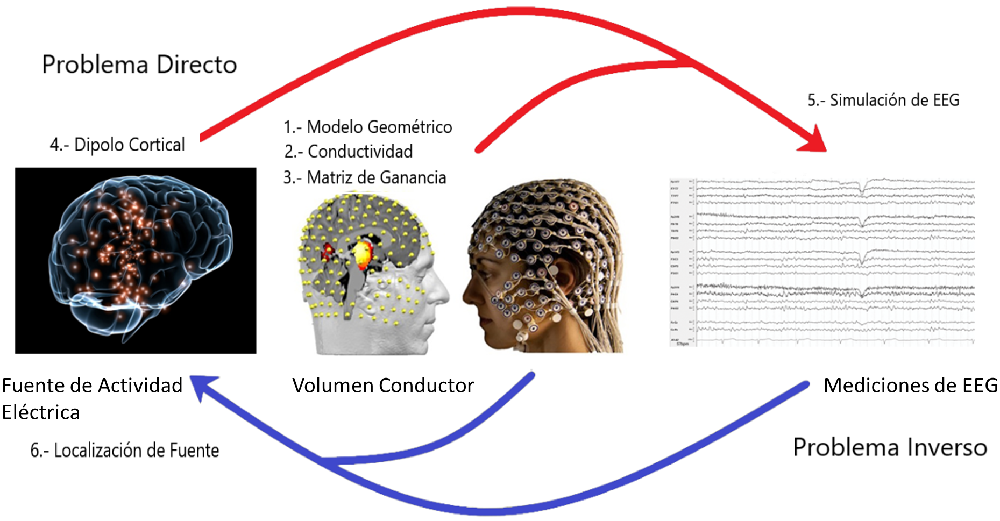

</div>
<div class="col-span-1">

**Problema Directo**

- En la primera etapa, se define el modelo geométrico realista de la cabeza (1).
- Luego, se varía la conductividad (2) y se calcula la matriz de ganancia (3), formando así nuestro modelo de volumen conductor.
- Posteriormente, se resuelve el problema directo utilizando el volumen conductor y un dipolo de corriente fijo (4).
- Esto da como resultado mediciones de EEG simuladas (5).

**Problema Inverso**

- Estas mediciones se emplean junto con el modelo de volumen conductor para resolver el problema inverso y localizar las fuentes de actividad neuronal (6).

</div>

</div>

<!--
Explicar el método propuesto:

-->

---
layout: pageBar
title: "Métodología - Construcción del Modelo Geométrico Realista"
---

# Metodología
Construcción del Modelo Geométrico Realista

<div class="grid grid-cols-3 gap-5 items-end justify-center">

<div class="col-span-1 flex flex-col items-center">
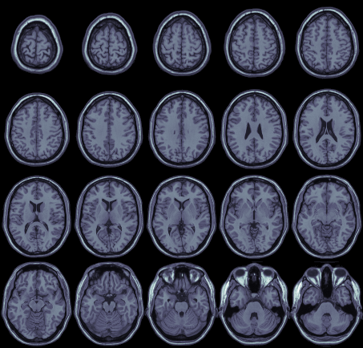
<p>Corte axial</p>
</div>

<div class="col-span-1 flex flex-col items-center">
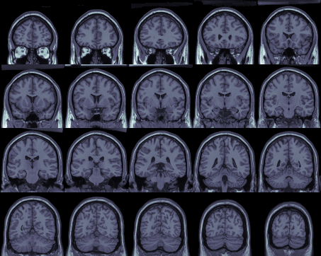
<p>Corte coronal</p>
</div>

<div class="col-span-1 flex flex-col items-center">
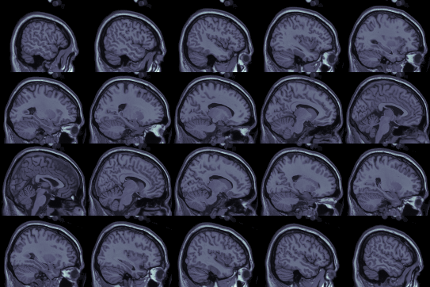
<p>Corte sagital</p>
</div>

</div>


Resonancia magnética de Colin27, utilizada como base para la construcción del modelo geométrico realista de la cabeza[^1].

<br>

[^1]: Colin27 MRI dataset, available at [BrainWeb](http://brainweb.bic.mni.mcgill.ca/brainweb/).

<!--
27 tomografías de resonancia magnética de un solo sujeto, utilizadas para construir un modelo geométrico realista de la cabeza.
Ponderadas en T1, T2 y PD.
Modelo 2008
-->

---
layout: pageBar
title: "Métodología - Modelo Geométrico Realista"
---

# Metodología
Modelo Geométrico Realista

<br>
<br>
<br>
<br>
<div class="container mx-auto max-w-15xl">
<!-- <div class="grid grid-cols-2 grid-rows-2 gap-5 items-end justify-center"> -->
<div class="grid grid-cols-4 gap-5 items-end justify-center">

  <div class="flex flex-col items-center">
      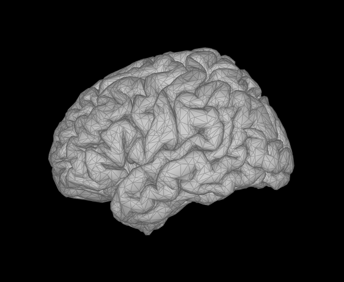
      <p>Corteza cerebral <br> Resolución: 29988 triángulos</p> 
  </div>

  <div class="flex flex-col items-center">
      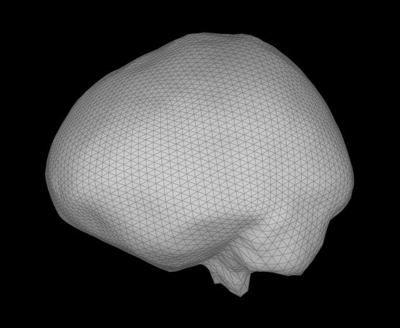
      <p>Capa interna del cráneo <br> Resolución: 8640 triángulos</p>
  </div>

  <div class="flex flex-col items-center">
      
      <p>Capa externa del cráneo <br> Resolución: 8640 triángulos</p>
  </div>

  <div class="flex flex-col items-center">
      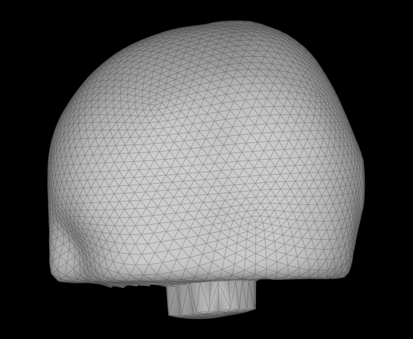
      <p>Cuero cabelludo <br> Resolución: 6480 triángulos</p>
  </div>

  </div>
</div>

<br>

- Mallas teseladas construidas a partir de la resonancia magnética de Colin27
- Cada malla representa una de las interfaces entre los tejidos de la cabeza

<!--
Here is another comment.
-->

---
layout: pageBar
title: "Métodología - Arreglo de Electrodos de EEG"
---
# Arreglo de Electrodos de EEG
Metodología

<div class="flex justify-center">
  
</div>

- Arreglo de electrodos EEG con sistema 10-10, tomada de la literatura[^2]
-  TODO: añadir modleo 3d del arreglo de electrodos

[^2]: Source: "EEG Electrode Placement" by John Doe, available at [EEG Source](http://example.com/eeg-source).

---
layout: pageBar
title: "Métodología - Modelo Geométrico Realista Completo"
---
# Modelo Geométrico Realista Completo
Metodología

<div class="flex justify-center">
  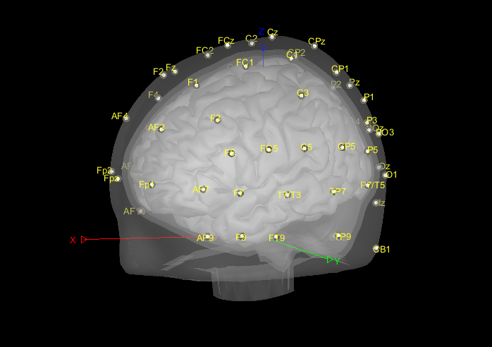
</div>

- Modelo completo de la cabeza, compuesto de las mallas de la corteza cerebral, cráneo, cuero cabelludo, y el arreglo de electrodos EEG.
- Ejes de coordenadas: X (rojo), Y (verde), Z (azul). 
<!-- TODO: añadir planos -->


---
layout: pageBar
title: "Metodología - Variación de la Conductividad"
---

# Variación de la Conductividad
Metodología - Problema Directo

<div class="grid grid-cols-2 gap-5 items-start justify-center mx-auto max-w-6xl p-4">

<div class="col-span-1">

- La conductividad de los tejidos de la cabeza son parámetros importantes en la simulación del EEG.
- Usualmente, se asumen valores nominales y se consideran constantes e isotrópicos.
- Sin embargo, la conductividad de estos tejidos varía en la realidad, dependiendo de factores como la edad, sexo, y patologías.
- En este trabajo, se considera la variación de la conductividad en los tejidos cerebrales y su efecto en la localización de fuentes de actividad neuronal.

</div>

<div class="col-span-1">
  <div class="overflow-x-auto shadow-sm rounded-lg">
  <table class="w-full table-auto border-collapse text-sm">
      <thead>
        <tr class="bg-gray-20 border-b-2">
          <th class="text-left px-3 py-2">ID</th>
          <th class="text-right px-3 py-2">BSCR</th>
          <th class="text-left px-3 py-2">Referencias</th>
          <th class="text-left px-3 py-2">Año</th>
        </tr>
      </thead>
    <tbody>
      <tr class="border-b">
        <td class="px-3 py-2">1</td>
        <td class="text-right px-3 py-2">79.36</td>
        <td class="px-3 py-2">Cohen1983</td>
        <td class="px-3 py-2">1990</td>
      </tr>
      <tr class="border-b">
        <td class="px-3 py-2">2</td>
        <td class="text-right px-3 py-2">208.33</td>
        <td class="px-3 py-2">eriksenVivoHumanHead1990</td>
        <td class="px-3 py-2">2003</td>
      </tr>
      <tr class="border-b">
        <td class="px-3 py-2">3</td>
        <td class="text-right px-3 py-2">68.96</td>
        <td class="px-3 py-2">gonalvesVivoMeasurementBrain2003</td>
        <td class="px-3 py-2">2004</td>
      </tr>
      <tr class="border-b">
        <td class="px-3 py-2">4</td>
        <td class="text-right px-3 py-2">22.17</td>
        <td class="px-3 py-2">Baysal2004</td>
        <td class="px-3 py-2">2004</td>
      </tr>
      <tr class="border-b">
        <td class="px-3 py-2">5</td>
        <td class="text-right px-3 py-2">26.24</td>
        <td class="px-3 py-2">Gutierrez2004</td>
        <td class="px-3 py-2">2011</td>
      </tr>
      <tr class="border-b">
        <td class="px-3 py-2">6</td>
        <td class="text-right px-3 py-2">41.84</td>
        <td class="px-3 py-2">Dannhauer2011</td>
        <td class="px-3 py-2">2014</td>
      </tr>
      <tr class="border-b">
        <td class="px-3 py-2">7</td>
        <td class="text-right px-3 py-2">33.00</td>
        <td class="px-3 py-2">aydinCombiningEEGMEG2014a</td>
        <td class="px-3 py-2">2016</td>
      </tr>
      <tr class="border-b">
        <td class="px-3 py-2">8</td>
        <td class="text-right px-3 py-2">10.30</td>
        <td class="px-3 py-2">acarHighresolutionEEGSource2016</td>
        <td class="px-3 py-2">2003</td>
      </tr>
      <tr class="border-b">
        <td class="px-3 py-2">9</td>
        <td class="text-right px-3 py-2">20.00</td>
        <td class="px-3 py-2">hoekemaMeasurementConductivitySkull2003</td>
        <td class="px-3 py-2">1968</td>
      </tr>
      <tr class="border-b">
        <td class="px-3 py-2">10</td>
        <td class="text-right px-3 py-2">80.00</td>
        <td class="px-3 py-2">Rush1968</td>
        <td class="px-3 py-2">1983</td>
      </tr>
    </tbody>
  </table>
</div>

<p class="text-sm mt-4">
<strong>Tabla 1:</strong> Valores de la razón de conductividad cerebro-cráneo (BSCR).
</p>
</div>
</div>

---
layout: pageBar
title: "Metodología - Matriz de Ganancia"
---

# Matriz de Ganancia
Metodología - Problema Directo

Regresando al sistema de la solución del problema directo

$$
  V = VL + V_{0}
$$

- $L$ es la matriz de ganancia, y define el modelo de la respuesta de los electrodos a la actividad neuronal generada por un dipolo eléctrico.

- En otras palabras, $L$ representa la relación entre las propiedades bioelectromagnéticas de los tejidos y las mediciones de EEG.

- Por lo tanto, fue necesario calcular la matriz de ganancia para cada variación de la conductividad en los tejidos cerebrales.

<p style="text-align: center;"> 

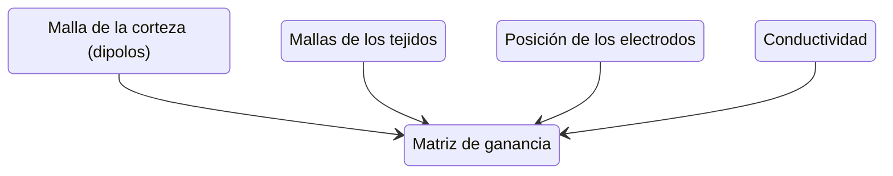
```mermaid
stateDiagram
A: Malla de la corteza (dipolos) 
B: Mallas de los tejidos
C: Posición de los electrodos
D: Conductividad
E: Matriz de ganancia

A --> E
B --> E
C --> E
D --> E 
``` 
</p>

- Obteniendo 10 matrices de ganancia, una para cada valor de la razón de conductividad cerebro-cráneo (BSCR).
- Cada matriz de ganancia tiene dimensiones $N_{e} \times N_{d}$, donde $N_{e}$ es el número de electrodos y $N_{d}$ es el número de dipolos.
- Por lo tanto, se obtuvieron 10 matrices de ganancia de dimensiones $45006 \times 65$.

---
layout: pageBar
title: "Metodología - Problema Directo"
---

# Simulación de Fuentes de Actividad Neuronal
Metodología

- El dipolo eléctrico es un modelo simplificado de la actividad neuronal correspondiente a una respuesta evocada (ER).
- Se definió un dipolo eléctrico con componentes X, Y, Z, y dirección y magnitud variables.

<div class="grid grid-cols-2 gap-5 items-end justify-center mx-auto max-w-6xl p-4">

<div class="col-span-1">
<div img="rounded" class="w-full max-w-md">
  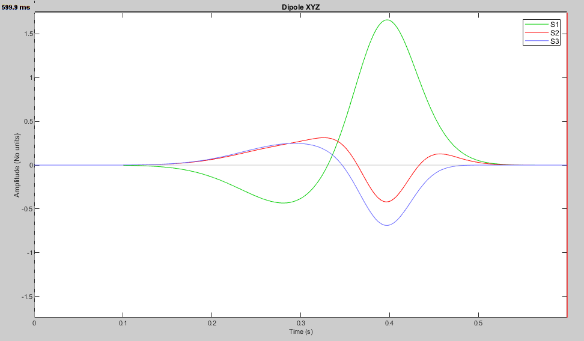
  <p class="text-sm">Función de dipolo eléctrico</p>
</div>
</div>

<div class="col-span-1">
<div img="rounded" class="w-full max-w-md">
  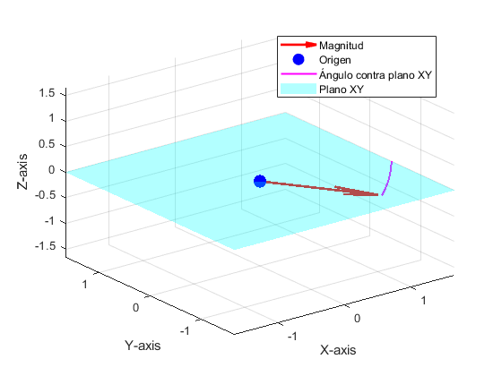
  <p class="text-sm">Dipolo eléctrico</p>
</div>
</div>
</div>

---
layout: pageBar
title: "Metodología - Dipolos Corticales"
---
# Dipolos Corticales
Metodología

<div class="grid grid-cols-3 gap-5 items-center justify-center">

<div class="col-span-2">
  <div class="flex justify-center">
    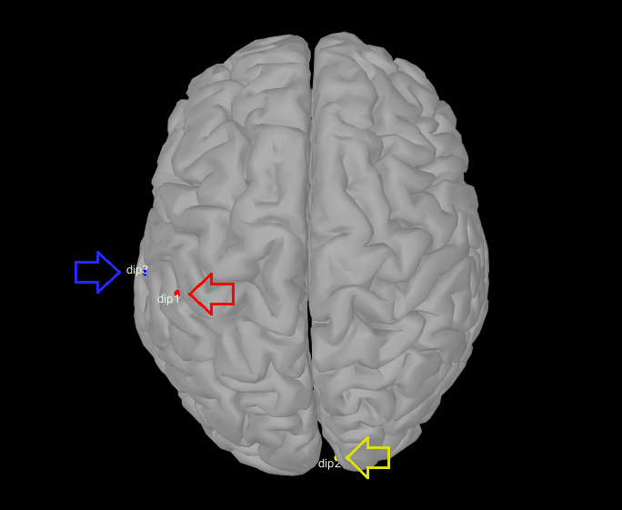
  </div>
</div>

<div class="col-span-1">

- Para tener un análisis más robusto, se consideraron 3 dipolos en diferentes regiones de la corteza cerebral.
- Estos dipolos representan la actividad neuronal de eventos evocados (ER) en diferentes regiones del cerebro.
- Se consideraron las zonas somatosensoriales (Dipolo 1), visuales (Dipolo 2), y auditivas (Dipolo 3).
- Estos dipolos se crearon como *scouts* en Brainstorm, y se utilizaron para resolver el problema directo.  
</div>

</div>


---
layout: pageBar
title: "Metodología - Simulación de EEG"
---

# Solución del Problema Directo
Metodología


2. **Datos de Entrada para el Problema Directo**: Los scouts se utilizaron como entrada para resolver el problema directo en Brainstorm, junto con:
   - La función del dipolo respecto al tiempo,
   - El modelo de conductor volumétrico basado en geometría realista,
   - La matriz de ganancia para cada BSCR, y
   - El arreglo de sensores de EEG.

3. **Mediciones de EEG Simuladas**: Este enfoque produjo 100 mediciones de EEG simuladas para cada BSCR en los tres scouts, lo que resultó en un total de 300 mediciones.

4. **Adición de Ruido para Condiciones Realistas**: Se añadió ruido a los datos simulados para considerar condiciones experimentales con pacientes, utilizando una relación señal/ruido (SNR) de 1%, 5%, y 10% de la magnitud de la señal. El ruido se añadió mediante la siguiente función de Brainstorm:


   $\text{Source} = \text{Source} + \text{SNR} \times (\text{randn}(\text{size}(\text{Source}) - 0.5)) \times \text{max}(\text{abs}(\text{Source}))$

   donde *Source* es la señal de EEG simulada y *SNR* es la razón señal/ruido.

5. **Conjunto de Datos Final**: Este proceso generó 3 sets de 10,000 mediciones para cada uno de los 3 dipolos, resultando en un total de 90,000 mediciones de EEG simuladas diferentes.


---
layout: pageBar
title: "Métodología - Problema Inverso"
---

# Proceso del Problema Directo
Metodología

<div class="grid grid-rows-2 gap-4 items-start justify-center">
<div class="row-span-1">

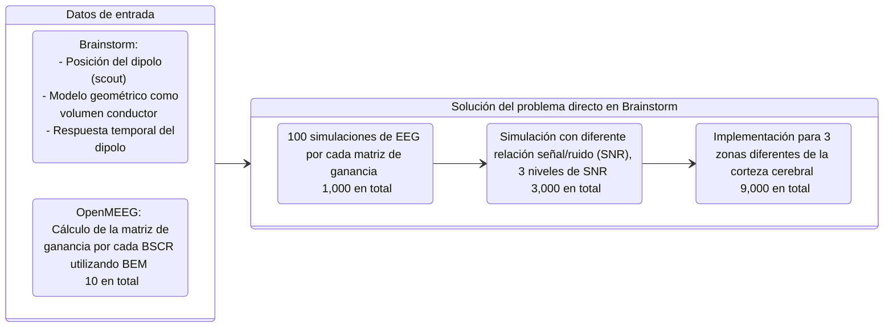
```mermaid {scale: 0.9}
stateDiagram-v2
  direction LR

  entry: Datos de entrada


  Scout: Brainstorm#58; <br> - Posición del dipolo (scout) <br> - Modelo geométrico como volumen conductor <br> - Respuesta temporal del dipolo
 
  BEM: OpenMEEG#58; <br> Cálculo de la matriz de ganancia por cada BSCR utilizando BEM <br> 10 en total

  PD: Solución del problema directo en Brainstorm

  PD1: 100 simulaciones de EEG por cada matriz de ganancia <br> 1,000 en total
  SNR: Simulación con diferente relación señal/ruido (SNR), 3 niveles de SNR <br> 3,000 en total
  Sol: Implementación para 3 zonas diferentes de la corteza cerebral <br> 9,000 en total


  entry --> PD
  state entry {
    direction LR
    BEM
    Scout
    }
  
  state PD {
    direction LR
    PD1 --> SNR
    SNR --> Sol
  }
```
</div>

<div class="row-span-1">
El ruido se añadió mediante la siguiente función de Brainstorm: 

$$\text{Source} = \text{Source} + \text{SNR} \times (\text{randn}(\text{size}(\text{Source}) - 0.5)) \times \text{max}(\text{abs}(\text{Source}))\text{,}$$

donde *Source* es la señal de EEG simulada y *SNR* es la razón señal/ruido.
</div>
</div>

---
layout: pageBar
title: "Métodología - Problema Inverso"
---

# Solución del Problema Inverso
Metodología

<div class="grid grid-rows-2 gap-4 items-start justify-center">
<div class="row-span-1">

- El método seleccionado para resolver el problema inverso fue el de filtrado espacial, específicamente, el método de filtrado espacial LCMV

- Los datos de EEG simulados se utilizaron como entrada para el método de filtrado espacial, junto con:
  - La matriz de ganancia para cada BSCR,
  - El modelo de conductor volumétrico basado en geometría realista, y
  - La posición de los electrodos de EEG.

</div>
<div class="row-span-1">

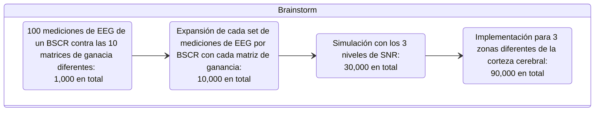
```mermaid 
stateDiagram-v2
  direction LR

  entry: Brainstorm

  1: 100 mediciones de EEG de un BSCR contra las 10 matrices de ganacia diferentes#58; <br> 1,000 en total
  2: Expansión de cada set de mediciones de EEG por BSCR con cada matriz de ganancia#58;<br>10,000 en total
  3: Simulación con los 3 niveles de SNR#58;<br>30,000 en total
  4: Implementación para 3 zonas diferentes de la corteza cerebral#58;<br>90,000 en total

  state entry {
    direction LR
    1 --> 2
    2 --> 3
    3 --> 4
    }
```
</div>
</div>

- El resultado de la solución del problema inverso es un kernel de imagen, el cual una vez ejecutado, proporciona un mapa de la actividad neuronal en la corteza cerebral denominado mapa de índice de actividad neuronal (PNAI).
  
---
layout: pageBar
title: "Métodología - Error de Localización"
---

# Cuantificación del Error de Localización
Metodología

<div class="grid grid-cols-2 gap-2 items-center justify-center">

  <div class="col-span-1">
  <div class="flex justify-center">
  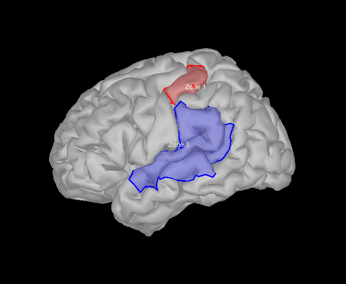
  </div>
  </div>

  <div class="col-span-1">
  <div class="flex justify-center">
  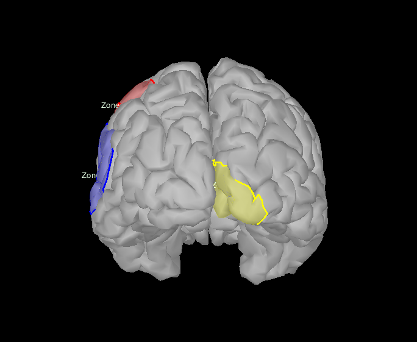
  </div>
  </div>
</div>


- Para cuantificar el error de localización de las fuentes de actividad neuronal, los resultados del problema inverso se separaron en grupos definidos por la razón de conductividad cerebro-cráneo (BSCR), la relación señal/ruido (SNR), y la región de la corteza cerebral.

- El error de localización se calculó como la distancia euclidiana entre la posición real del dipolo y la posición estimada por el método de filtrado espacial.

- A su vez, esta posición estimada se definió como el punto de máxima actividad neuronal en la ROI correspondiente al dipolo de origen.


<!-- 
t = 397.2
d1 = 29.17 cm2
d2 = 51.75 cm2
d3 = 76.92.17 cm2
 -->
---
layout: pageBar
title: "Métodología - Error de Localización"
---

# Estandarización del Error de Localización
Metodología

- La distancia entre la posición real y la estimada tenía una tendencia a 0, salvo algunos valores atípicos provocados por la introducción de ruido en los datos simulados.

- Por lo tanto, se tomaron tres medidas para estandarizar el error de localización:
  - Debido a la distribución sesgada a la derecha de los datos, se utilizó la media del percentil 95 como medida de tendencia central.
  - Se calculó la media y la desviación estándar de la distancia euclidiana entre los vértices de la malla de la corteza cerebral.
  - Se dividió el error de localización por la media de la resolución de la malla de la corteza cerebral, obteniendo así una medida adimensional del error de localización.

- Quedando así, el error de localización estandarizado como:

	$$\text{Error}_{\text{estandarizado}} = \frac{\text{Posición}_{\text{localización}}-\text{Posición}_{\text{real}}}{\text{Distancia media}_{\text{vértices}}}\text{,}$$

  y la desviación estándar del error de localización estandarizado como:

  $$\text{Desviación estándar}_{\text{estandarizada}} = \frac{\text{Desviación estándar}_{\text{localización}}}{\text{Distancia media}_{\text{vértices}}}\text{.}$$

---
layout: pageBar
title: "Métodología - Análisis Estadístico"
---

# Análisis Estadístico
Metodología

- Para evaluar el desempeño del estimador de la posición de la fuente de actividad neuronal, se utilizó la frontera de Cramér-Rao.
- La frontera de Cramér-Rao es una cota inferior para la varianza de un estimador no sesgado.
- Este límite teórico inferior de la varianza del error para un estimador no sesgado se representa como una desigualdad con el valor esperado del estimador de la forma:

$$\text{E}\left\{(\hat{\theta} - \theta)(\hat{\theta} - \theta)^{\text{T}}\right\} \geq \text{CRB}(\theta)\text{,}$$

donde $\hat{\theta}$ es el estimador, $\theta$ es el parámetro de interés, y $\text{CRB}(\theta)$ es la matriz de Cramér-Rao.

- Esta a su vez se puede definir como la inversa de la matriz de información de Fisher,

<div class="grid grid-cols-3 gap-2 items-center justify-center">

  <div class="col-span-1">
  <div class="flex justify-center">
  
  $$\text{CRB}(\theta) = \left[\mathcal{I}(\theta)\right]^{-1}\text{,}$$
  
  </div>
  </div>

  <div class="col-span-1">
  <div class="flex justify-center">
  y en términos de la matriz de información de Fisher para el EEG, se tiene:
  
  </div>
  </div>
  
  <div class="col-span-1">
 <div class="flex justify-center">

$$\text{CRB}(\theta) = [J^{\text{EEG}}(\theta)]^{-1}\text{,}$$
</div>
</div>
</div>

Expandiendo la matriz de información de Fisher para el EEG, se obtiene:
$$
J_{ij}^{\text{EEG}}(\theta) = q^{\text{T}}\left(\frac{\partial k}{\partial \theta_{i}}\right)^{\text{T}}\frac{\text{L}^{\text{T}}\text{L}}{\sigma^2_{\text{E}}}\left(\frac{\partial k}{\partial \theta_{i}}\right)q\text{,}
$$

donde $q$ es la magnitud del dipolo en el instante de 397.2 ms, $\text{L}$ es la matriz de ganancia, $\sigma^2_{\text{E}}$ es la varianza del ruido de las mediciones de EEG, y $\frac{\partial k}{\partial \theta_{i}}$ es la derivada parcial de las posiciones de los dipolos con respecto a la posición de los sensores de EEG .


---
layout: pageBar
title: "Métodología - Análisis Estadístico"
---

# Proceso del Análisis Estadístico
Metodología

- El proceso de análisis estadístico de los resultados del problema inverso se realizó en Matlab y Mathematica, y constó de las siguientes etapas:

<br>
<br>

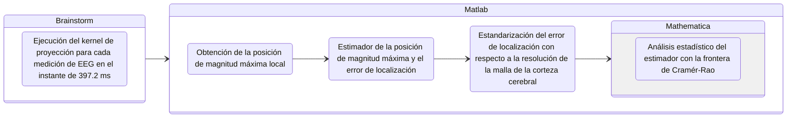
```mermaid 
stateDiagram-v2
  direction LR

  entry: Brainstorm
  mat: Matlab
  math: Mathematica

  1: Ejecución del kernel de proyección para cada medición de EEG en el instante de 397.2 ms
  2: Obtención de la posición de magnitud máxima local
  3: Estimador de la posición de magnitud máxima y el error de localización
  4: Estandarización del error de localización con respecto a la resolución de la malla de la corteza cerebral
  5: Análisis estadístico del estimador con la frontera de Cramér-Rao

  entry --> mat
  state entry {
    direction LR
    1 
    }

  state mat {
    direction LR
    2 --> 3
    3 --> 4
    4 --> math
    state math {
      direction LR
      5
    }
  }
  
```

---
layout: pageBar
title: "Resultados"
---

# Resultados
Resumen


---
layout: pageBar
title: "Resultados"
---

# Solución del Problema Directo
Resultados

<div class="grid grid-cols-3 gap-2 items-start justify-center">
<div class="col-span-2">
<div class="flex justify-center">
<div img="rounded" class="w-full max-w-2xl">
  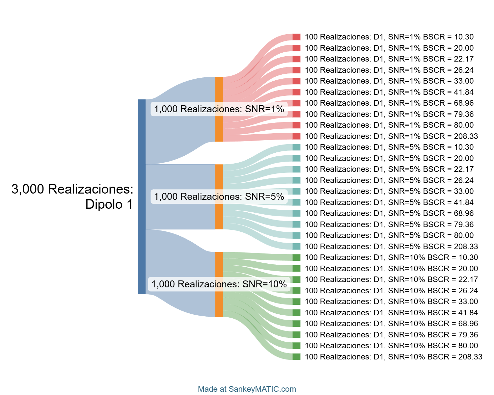
</div>
</div>
</div>

<div class="col-span-1">
<div class="flex justify-center">

- Diagrama de la distribución de las mediciones de EEG simuladas en el problema directo.
- El resultado final del problema directo es un conjunto de mediciones de EEG simuladas para cada BSCR, SNR, y dipolo cortical.
- Obteniendo un total de 3,000 mediciones de EEG simuladas para cada dipolo cortical, sumando 9,000 en total.
</div>
</div>
</div>

---
layout: pageBar
title: "Resultados - Señales de EEG"
---

# Señales de EEG Simuladas
Resultados

<div class="w-full h-full grid grid-cols-2 grid-rows-2 gap-4 items-center justify-center p-4">
  <!-- First Cell -->
  <div class="flex justify-center">
    <div class="w-full max-w-md rounded">
      
      <p class="text-center text-m mt-2">Señales de EEG simuladas con BSCR = 10</p>
    </div>
  </div>

  <!-- Second Cell -->
  <div class="flex justify-center">
    <div class="w-full max-w-md rounded">
      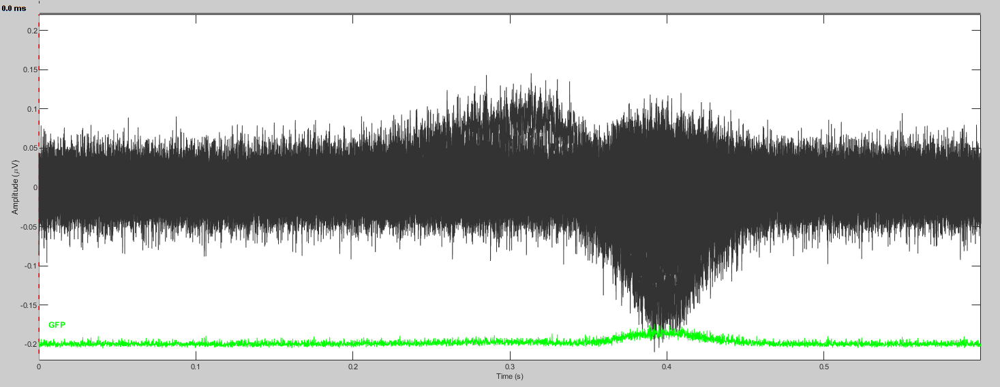
      <p class="text-center text-m mt-2">Señales de EEG simuladas con BSCR = 20</p>
    </div>
  </div>

  <!-- Third Cell -->
  <div class="flex justify-center">
    <div class="w-full max-w-md rounded">
      
      <p class="text-center text-m mt-2">Señales de EEG simuladas con BSCR = 80</p>
    </div>
  </div>

  <!-- Fourth Cell -->
  <div class="flex justify-center">
    <div class="w-full max-w-md rounded">
      
      <p class="text-center text-m mt-2">Señales de EEG simuladas con BSCR = 200</p>
    </div>
  </div>
</div>


---
layout: pageBar
title: "Resultados - Problema Inverso"
---

# Solución del Problema Inverso
Resultados

<div class="grid grid-cols-3 gap-2 items-start justify-center">
<div class="col-span-2">
<div class="flex justify-center">
<div img="rounded" class="w-full max-w-2xl">
  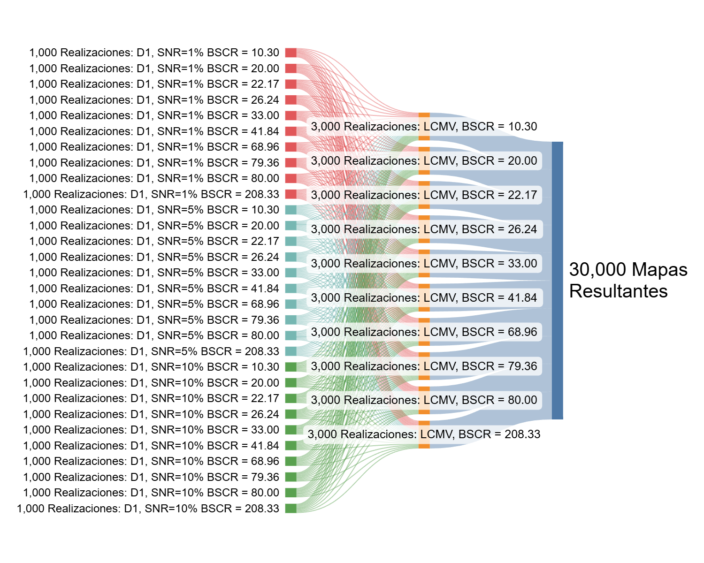
</div>
</div>
</div>

<div class="col-span-1">
<div class="flex justify-center">

- Diagrama de la distribución de la solución del problema inverso.
- El resultado final del problema inverso es un conjunto de mapas de actividad neuronal para conjuntos de datos simulados con diferentes BSCR y SNR.
- Obteniendo un total de 30,000 mapas de actividad neuronal para cada dipolo cortical, sumando 90,000 en total.

</div>
</div>
</div>


---
layout: pageBar
title: "Resultados - Mapas de Actividad Neuronal"
---

# Mapas de Actividad Neuronal
Resultados


<div class="w-full h-full grid grid-cols-2 gap-2 items-stretch justify-stretch">
  <!-- First Cell -->
  <div class="flex flex-col items-center justify-center p-2">
    <div class="w-full max-w-xl h-full flex flex-col justify-between">
      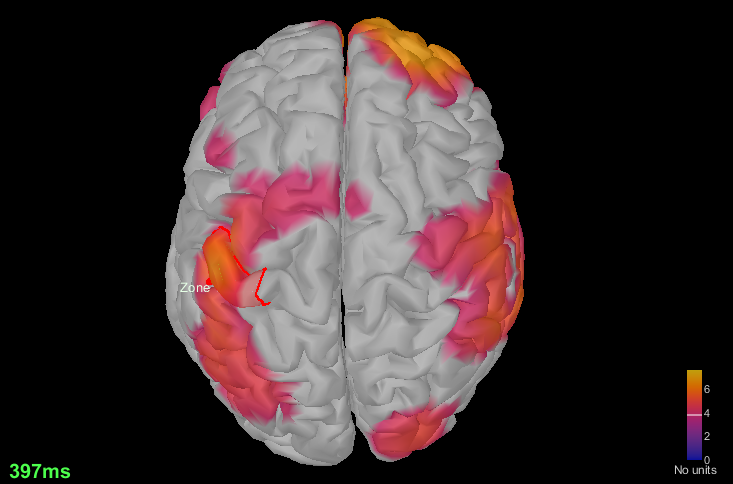
      <p class="text-center text-m mt-2">Señales de EEG simuladas con BSCR = 10</p>
    </div>
  </div>

  <!-- Second Cell -->
  <div class="flex flex-col items-center justify-center p-2">
    <div class="w-full max-w-xl h-full flex flex-col justify-between">
      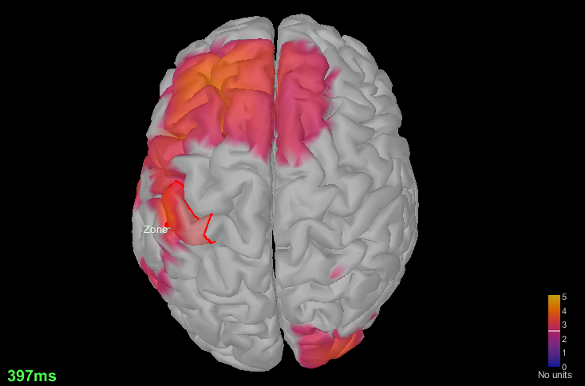
      <p class="text-center text-m mt-2">Señales de EEG simuladas con BSCR = 20</p>
    </div>
  </div>

</div>


---
layout: pageBar
title: "Resultados - Mapas de Actividad Neuronal"
---

# Mapas de Actividad Neuronal
Resultados


<div class="w-full h-full grid grid-cols-2 gap-2 items-stretch justify-stretch">

  <!-- Third Cell -->
  <div class="flex flex-col items-center justify-center p-2">
    <div class="w-full max-w-xl h-full flex flex-col justify-between">
      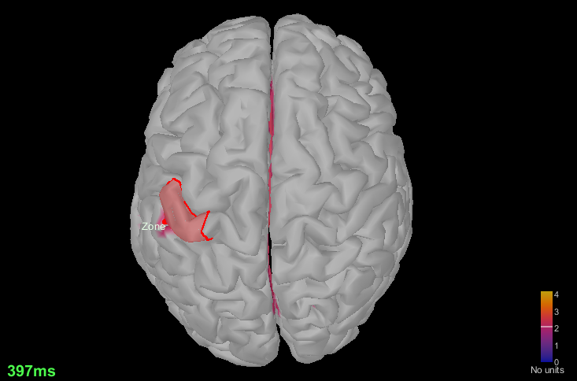
      <p class="text-center text-m mt-2">Señales de EEG simuladas con BSCR = 80</p>
    </div>
  </div>

  <!-- Fourth Cell -->
  <div class="flex flex-col items-center justify-center p-2">
    <div class="w-full max-w-xl h-full flex flex-col justify-between">
      
      <p class="text-center text-m mt-2">Señales de EEG simuladas con BSCR = 200</p>
    </div>
  </div>
</div>


---
layout: pageBar
title: "Resultados - Error de Localización"
---

# Error de Localización
Resultados

<div class="grid grid-cols-3 gap-2 items-start justify-center">
<div class="col-span-2">
<div class="flex justify-center">
<div img="rounded" class="w-full max-w-2xl">
  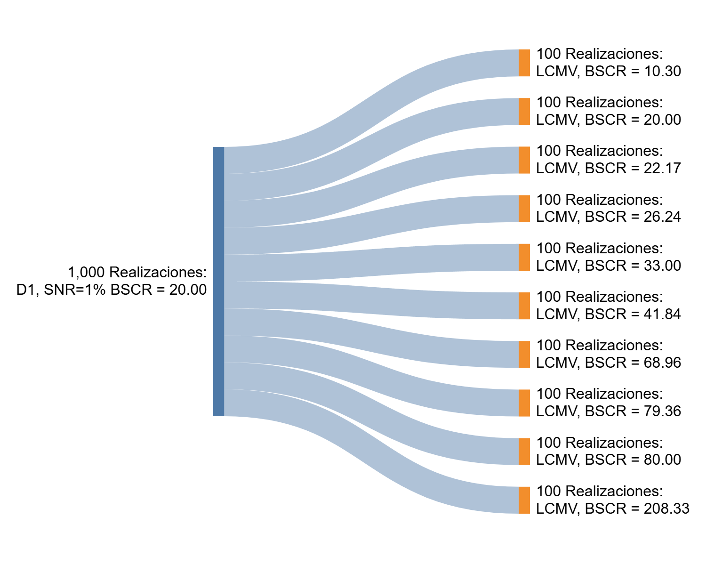
</div>
</div>
</div>

<div class="col-span-1">
<div class="flex justify-center">

- Diagrama de la distribución del error de localización del dipolo 1, correspondiente a la zona somatosensorial
- Los datos de entrada son las mediciones de EEG simuladas con BSCR = 200 y SNR = 1%
- Cada grupo de resultados corresponde a una solución del problema inverso utilizando diferentes valores de BSCR
- Efectivamente comparando el desempeño de variar la razón de conductividad cerebro-cráneo en la localización de la fuente de actividad neuronal

</div>
</div>
</div>

---
layout: pageBar
title: "Resultados - Error de Localización"
---

# Error de Localización
Resultados


<div class="w-full h-full grid grid-cols-2 gap-2 items-stretch justify-stretch">
  <!-- First Cell -->
  <div class="flex flex-col items-center justify-center p-2">
    <div class="w-full max-w-xl h-full flex flex-col justify-between">
      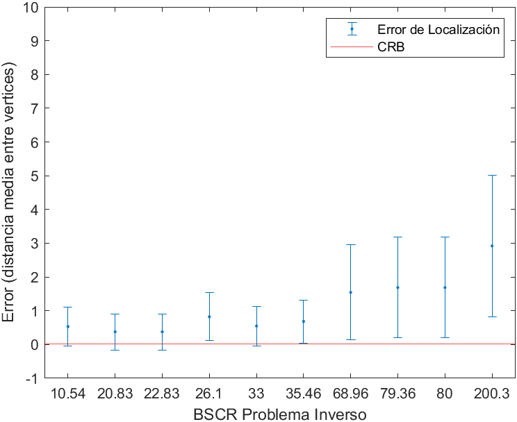
      <p class="text-center text-m mt-2">Error en la localización de la fuente de actividad neuronal <br>BSCR = 10</p>
    </div>
  </div>

  <!-- Second Cell -->
  <div class="flex flex-col items-center justify-center p-2">
    <div class="w-full max-w-xl h-full flex flex-col justify-between">
      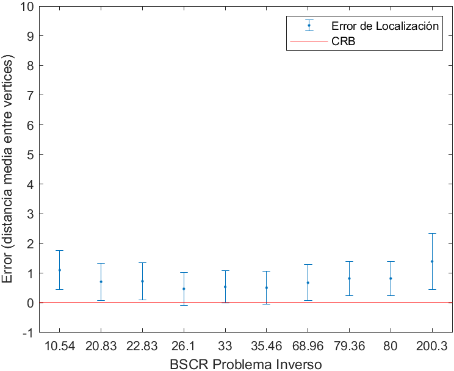
      <p class="text-center text-m mt-2">Error en la localización de la fuente de actividad neuronal <br>BSCR = 20</p>
    </div>
  </div>

</div>


---
layout: pageBar
title: "Resultados - Error de Localización"
---

# Error de Localización
Resultados


<div class="w-full h-full grid grid-cols-2 gap-2 items-stretch justify-stretch">

  <!-- Third Cell -->
  <div class="flex flex-col items-center justify-center p-2">
    <div class="w-full max-w-xl h-full flex flex-col justify-between">
      
      <p class="text-center text-m mt-2">Error en la localización de la fuente de actividad neuronal <br>BSCR = 80</p>
    </div>
  </div>

  <!-- Fourth Cell -->
  <div class="flex flex-col items-center justify-center p-2">
    <div class="w-full max-w-xl h-full flex flex-col justify-between">
      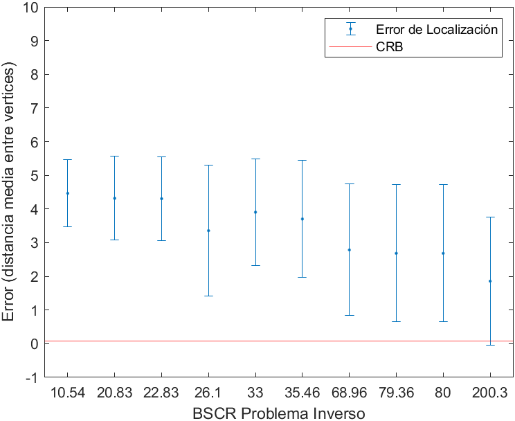
      <p class="text-center text-m mt-2">Error en la localización de la fuente de actividad neuronal <br>BSCR = 200</p>
    </div>
  </div>
</div>

---
layout: pageBar
title: "Resultados - Evaluación del Error"
---

# Evaluación del Error Incurrido
Resultados

Error incurrido en la localización de la fuente de actividad neuronal en con
el dipolo en la zona visual y los tres niveles de SNR

<div class="w-full h-full grid grid-cols-2 gap-2 items-stretch justify-stretch">

  <!-- Third Cell -->
  <div class="flex flex-col items-center justify-center p-2">
    <div class="w-full max-w-lg h-full flex flex-col justify-between">
      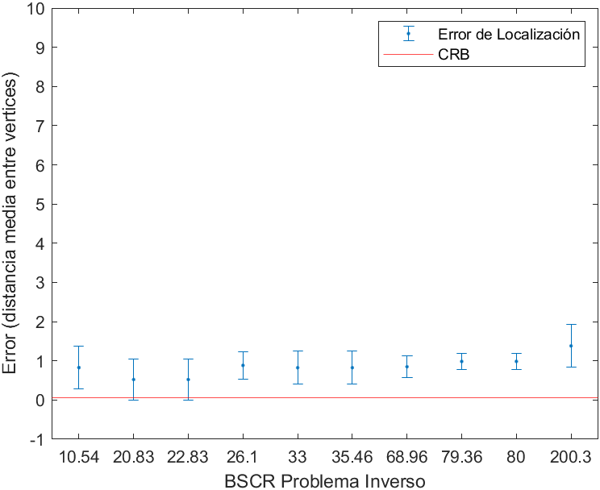
      <p class="text-center text-m mt-2">Error en la localización de la fuente de actividad neuronal con BSCR = 20 y SNR = 1%.</p>
    </div>
  </div>

  <!-- Fourth Cell -->
  <div class="flex flex-col items-center justify-center p-2">
    <div class="w-full max-w-lg h-full flex flex-col justify-between">
      
      <p class="text-center text-m mt-2">Error en la localización de la fuente de actividad neuronal con BSCR = 80 y SNR = 1%.</p>
    </div>
  </div>
</div>

---
layout: pageBar
title: "Resultados - Evaluación del Error"
---

# Evaluación del Error Incurrido
Resultados

Error incurrido en la localización de la fuente de actividad neuronal en con
el dipolo en la zona visual y los tres niveles de SNR

<div class="w-full h-full grid grid-cols-2 gap-2 items-stretch justify-stretch">

  <!-- Third Cell -->
  <div class="flex flex-col items-center justify-center p-2">
    <div class="w-full max-w-lg h-full flex flex-col justify-between">
      
      <p class="text-center text-m mt-2">Error en la localización de la fuente de actividad neuronal con BSCR = 20 y SNR = 5%.</p>
    </div>
  </div>

  <!-- Fourth Cell -->
  <div class="flex flex-col items-center justify-center p-2">
    <div class="w-full max-w-lg h-full flex flex-col justify-between">
      
      <p class="text-center text-m mt-2">Error en la localización de la fuente de actividad neuronal con BSCR = 80 y SNR = 5%.</p>
    </div>
  </div>
</div>

---
layout: pageBar
title: "Resultados - Evaluación del Error"
---

# Evaluación del Error Incurrido
Resultados

Error incurrido en la localización de la fuente de actividad neuronal en con
el dipolo en la zona visual y los tres niveles de SNR

<div class="w-full h-full grid grid-cols-2 gap-2 items-stretch justify-stretch">

  <!-- Third Cell -->
  <div class="flex flex-col items-center justify-center p-2">
    <div class="w-full max-w-lg h-full flex flex-col justify-between">
      
      <p class="text-center text-m mt-2">Error en la localización de la fuente de actividad neuronal con BSCR = 20 y SNR = 10%.</p>
    </div>
  </div>

  <!-- Fourth Cell -->
  <div class="flex flex-col items-center justify-center p-2">
    <div class="w-full max-w-lg h-full flex flex-col justify-between">
      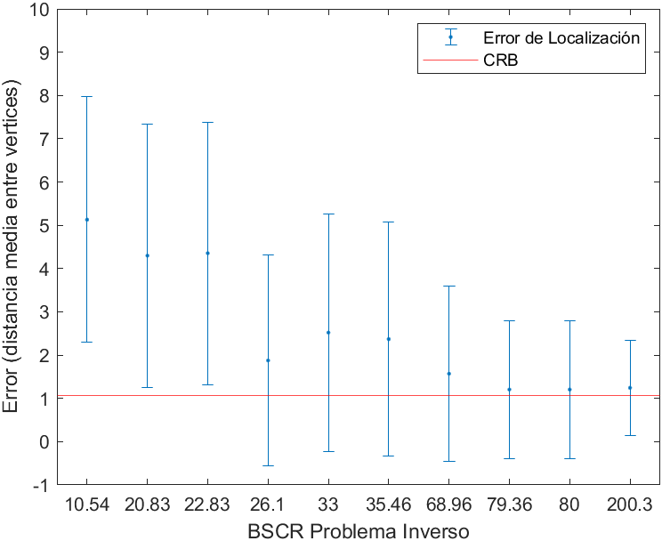
      <p class="text-center text-m mt-2">Error en la localización de la fuente de actividad neuronal con BSCR = 80 y SNR = 10%.</p>
    </div>
  </div>
</div>

---
layout: pageBar
title: "Resultados - Evaluación del Error"
---

# Evaluación del Error Incurrido General
Resultados

<div class="grid grid-cols-3 gap-2 items-start justify-center">
<div class="col-span-2">
<div class="flex justify-center">
<div img="rounded" class="w-full max-w-3xl">
  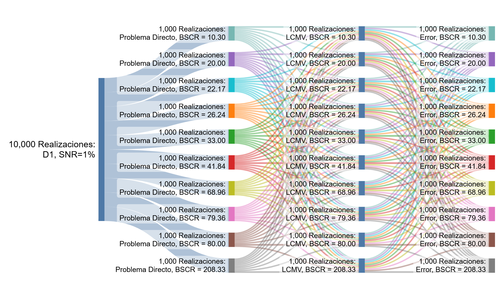
</div>
</div>
</div>

<div class="col-span-1">
<div class="flex justify-center">

- Diagrama de la distribución del error de localización sin considerar el valor de BSCR utilizado en la solución del problema inverso.
- El fin de este análisis es evaluar el error general incurrido en la solución del problema inverso por grupo de datos simulados con el mismo BSCR en el problema directo.
- Esto nos permite cuantificar el error de localización cuando el BSCR varía en la solución del problema directo.


</div>
</div>
</div>

---
layout: pageBar
title: "Resultados - Evaluación del Error General"
---

# Evaluación del Error Incurrido
Resultados

Distribución del error incurrido con el uso de diferentes valores de BSCR en la simulación y localización de fuentes de actividad neuronal.

<div class="w-full h-full grid grid-cols-2 gap-2 items-stretch justify-stretch">

  <!-- Third Cell -->
  <div class="flex flex-col items-center justify-center p-2">
    <div class="w-full max-w-lg h-full flex flex-col justify-between">
      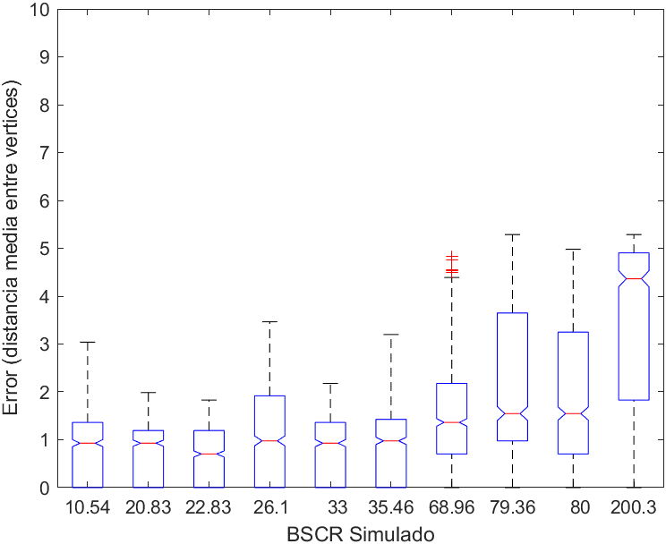
      <p class="text-center text-m mt-2">Dipolo 1 (somatosensorial), SNR 1 %</p>
    </div>
  </div>

  <!-- Fourth Cell -->
  <div class="flex flex-col items-center justify-center p-2">
    <div class="w-full max-w-lg h-full flex flex-col justify-between">
      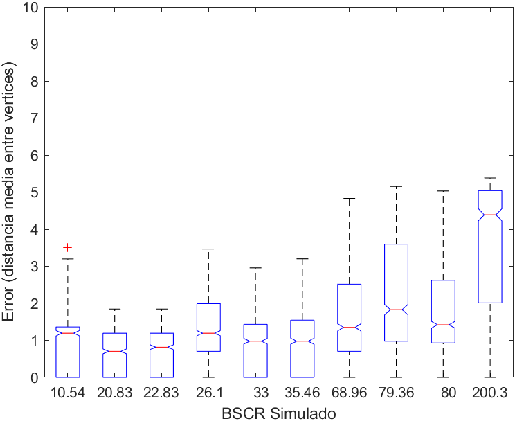
      <p class="text-center text-m mt-2">Dipolo 1 (somatosensorial), SNR 10 %</p>
    </div>
  </div>
</div>

<!-- Recordar a la audiencia que loas cruces son outliers y son pocos -->

---
layout: pageBar
title: "Resultados - Evaluación del Error General"
---

# Evaluación del Error Incurrido
Resultados

Distribución del error incurrido con el uso de diferentes valores de BSCR en la simulación y localización de fuentes de actividad neuronal.

<div class="w-full h-full grid grid-cols-2 gap-2 items-stretch justify-stretch">

  <!-- Third Cell -->
  <div class="flex flex-col items-center justify-center p-2">
    <div class="w-full max-w-lg h-full flex flex-col justify-between">
      
      <p class="text-center text-m mt-2">Dipolo 2 (visual), SNR 1 %</p>
    </div>
  </div>

  <!-- Fourth Cell -->
  <div class="flex flex-col items-center justify-center p-2">
    <div class="w-full max-w-lg h-full flex flex-col justify-between">
      
      <p class="text-center text-m mt-2">Dipolo 2 (visual), SNR 10 %</p>
    </div>
  </div>
</div>

---
layout: pageBar
title: "Resultados - Evaluación del Error General"
---

# Evaluación del Error Incurrido
Resultados

Distribución del error incurrido con el uso de diferentes valores de BSCR en la simulación y localización de fuentes de actividad neuronal.

<div class="w-full h-full grid grid-cols-2 gap-2 items-stretch justify-stretch">

  <!-- Third Cell -->
  <div class="flex flex-col items-center justify-center p-2">
    <div class="w-full max-w-lg h-full flex flex-col justify-between">
      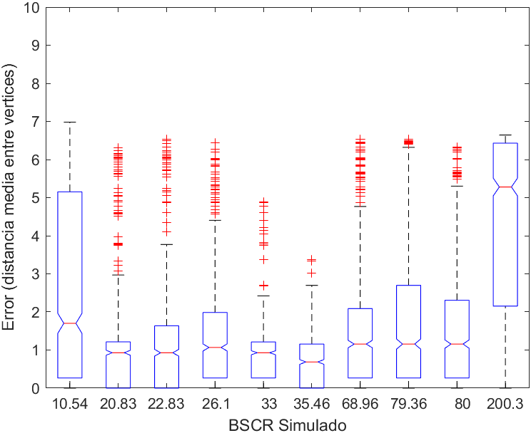
      <p class="text-center text-m mt-2">Dipolo 3 (auditiva), SNR 1 %</p>
    </div>
  </div>

  <!-- Fourth Cell -->
  <div class="flex flex-col items-center justify-center p-2">
    <div class="w-full max-w-lg h-full flex flex-col justify-between">
      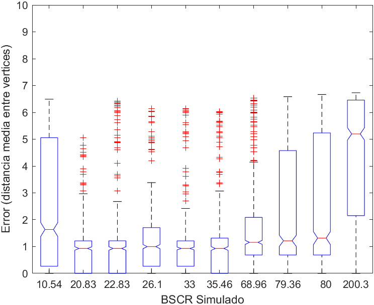
      <p class="text-center text-m mt-2">Dipolo 3 (auditiva), SNR 10 %</p>
    </div>
  </div>
</div>

---
layout: pageBar
title: "Conclusiones"
---

# Variabilidad del BSCR
Conclusiones

- La variación de la razón de conductividad cerebro-cráneo en la solución del problema directo afecta significativamente la localización de la fuente de actividad neuronal en la solución del problema inverso.

- La variación del BSCR en la solución del problema inverso tiene un impacto en la precisión de la localización de la fuente de actividad neuronal, pero no de manera significativa con valores no extremos.


---

# Clicks Animations

You can add `v-click` to elements to add a click animation.

<div v-click>

This shows up when you click the slide:

```html
<div v-click>This shows up when you click the slide.</div>
```

</div>

<br>

<v-click>

The <span v-mark.red="3"><code>v-mark</code> directive</span>
also allows you to add
<span v-mark.circle.orange="4">inline marks</span>
, powered by [Rough Notation](https://roughnotation.com/):

```html
<span v-mark.underline.orange>inline markers</span>
```

</v-click>

<div mt-20 v-click>

[Learn More](https://sli.dev/guide/animations#click-animation)

</div>


---

# LaTeX

LaTeX is supported out-of-box. Powered by [KaTeX](https://katex.org/).

<div h-3 />

Inline $\sqrt{3x-1}+(1+x)^2$

Block
$$ {1|3|all}
\begin{aligned}
\nabla \cdot \vec{E} &= \frac{\rho}{\varepsilon_0} \\
\nabla \cdot \vec{B} &= 0 \\
\nabla \times \vec{E} &= -\frac{\partial\vec{B}}{\partial t} \\
\nabla \times \vec{B} &= \mu_0\vec{J} + \mu_0\varepsilon_0\frac{\partial\vec{E}}{\partial t}
\end{aligned}
$$

[Learn more](https://sli.dev/features/latex)

---

# Diagrams

You can create diagrams / graphs from textual descriptions, directly in your Markdown.

<div class="grid grid-cols-4 gap-5 pt-4 -mb-6">

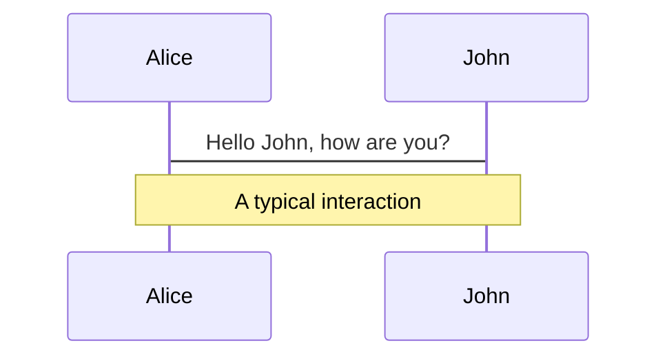
```mermaid {scale: 0.5, alt: 'A simple sequence diagram'}
sequenceDiagram
    Alice->John: Hello John, how are you?
    Note over Alice,John: A typical interaction
```

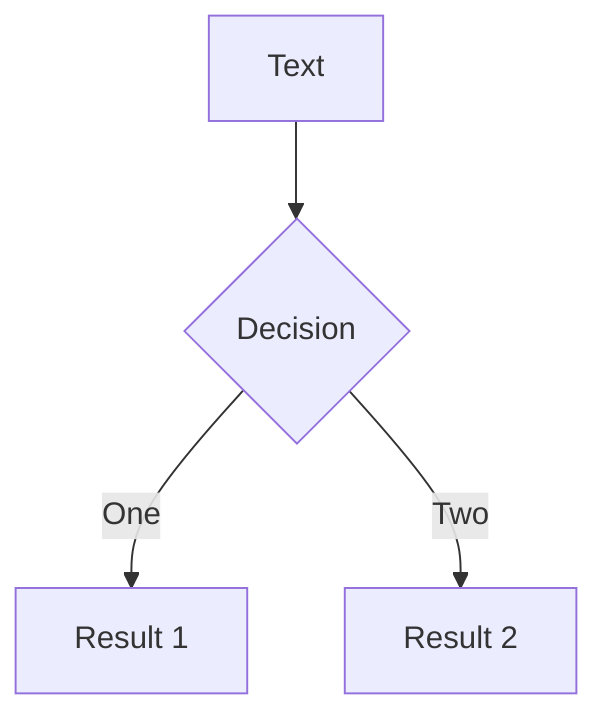
```mermaid {theme: 'neutral', scale: 0.8}
graph TD
B[Text] --> C{Decision}
C -->|One| D[Result 1]
C -->|Two| E[Result 2]
```

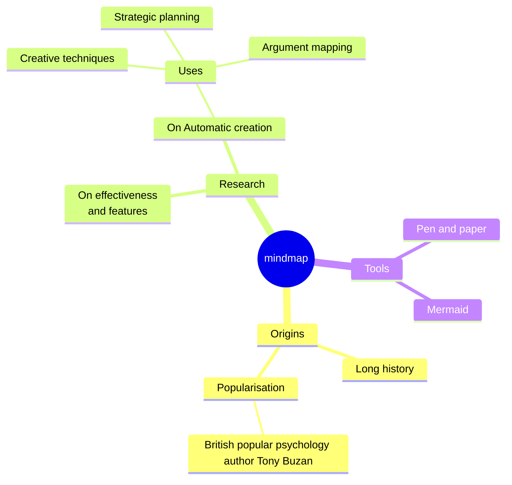
```mermaid
mindmap
  root((mindmap))
    Origins
      Long history
      ::icon(fa fa-book)
      Popularisation
        British popular psychology author Tony Buzan
    Research
      On effectiveness<br/>and features
      On Automatic creation
        Uses
            Creative techniques
            Strategic planning
            Argument mapping
    Tools
      Pen and paper
      Mermaid
```

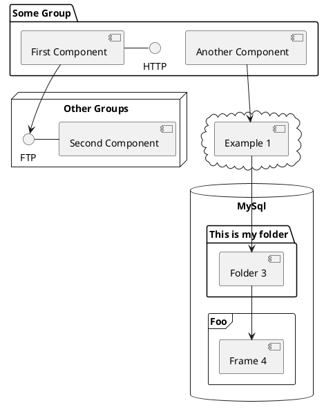
```plantuml {scale: 0.7}
@startuml

package "Some Group" {
  HTTP - [First Component]
  [Another Component]
}

node "Other Groups" {
  FTP - [Second Component]
  [First Component] --> FTP
}

cloud {
  [Example 1]
}

database "MySql" {
  folder "This is my folder" {
    [Folder 3]
  }
  frame "Foo" {
    [Frame 4]
  }
}

[Another Component] --> [Example 1]
[Example 1] --> [Folder 3]
[Folder 3] --> [Frame 4]

@enduml
```

</div>

Learn More: [Mermaid Diagrams](https://sli.dev/guide/features/mermaid) and [PlantUML Diagrams](https://sli.dev/guide/features/plantuml)


---
layout: center
class: text-center
---

# Learn More

[Documentation](https://sli.dev) · [GitHub](https://github.com/slidevjs/slidev) · [Showcases](https://sli.dev/showcases.html)

<PoweredBySlidev mt-10 />
