<br>
<!-- <p style="color:#0FA3B1;">Don't explicitly put title on cover page 🥳 </p>
<p style="color:#0FA3B1;">Put your own logo somewhere </p> -->

 </img>

<style scoped>
#ATLAS {
  width: 180px;
  position: absolute;
  right: 3%;
  bottom: 4%;
  /* background-color: #2B90B6;
  background-image: linear-gradient(45deg, #4EC5D4 15%, #146b8c 50%); */
}
</style>


---
layout: two-cols
layoutClass: gap-16
---

# Table of contents

You can use the `Toc` component to generate a table of contents for your slides:

```html
<Toc minDepth="1" maxDepth="1"></Toc>
```

The title will be inferred from your slide content, or you can override it with `title` and `level` in your frontmatter.

::right::

<Toc v-click minDepth="1" maxDepth="2"></Toc>

---
layout: pageBar
title: "Introducción"
---

# Introducción
EEG y su uso en la localización de fuentes de actividad neuronal. blah blah

<div class="grid grid-cols-2 gap-5 items-center justify-center">

<div class="col-span-1">

$$
	V(r) = \frac{2\sigma_{0}}{\sigma_{k}^{-} + {\sigma_{k}^{+}}} V_{0}(r) + \frac{1}{2\pi} \sum_{j=1}^{R}\frac{\sigma_{j}^{-}-\sigma_{j}^{+}}{\sigma_{k}^{-}+\sigma_{k}^{+}} \int_{r'\varepsilon S_{j}} V(r') \frac{r'-r}{||r'-r||^3}\partial S_{j}
$$


El EEG es una técnica no invasiva que permite medir la actividad eléctrica del cerebro. La localización de fuentes de actividad neuronal es un problema inverso que consiste en estimar la actividad eléctrica en el cerebro a partir de las mediciones del EEG.


</div>

<div class="col-span-1">

- 📝 **Text-based** - focus on the content with Markdown, and then style them later
- 🎨 **Themable** - theme can be shared and used with npm packages
- 🧑‍💻 **Developer Friendly** - code highlighting, live coding with autocompletion
- 🤹 **Interactive** - embedding Vue components to enhance your expressions
- 🎥 **Recording** - built-in recording and camera view
- 📤 **Portable** - export into PDF, PNGs, or even a hostable SPA
- 🛠 **Hackable** - anything possible on a webpage

</div>

</div>


---
layout: pageBar
title: "Métodología - Método Propuesto"
---

# Metodología
Método Propuesto


El método propuesto para poner a prueba la hipótesis de que la variación de la conductividad cerebral afecta la localización de fuentes de actividad neuronal consta de las siguientes etapas:

- **Modelo Geométrico**: 

Se realiza una aproximación estructural y se determinan las propiedades bioelectromagnéticas de los tejidos, incluyendo las variaciones de conductividad.

- **Solución del problema directo**:

Se utilizan dipolos eléctricos para modelar puntos fijos de actividad neuronal, equivalentes a respuestas evocadas (ER). Se representa matricialmente las variaciones espacio-temporales del dipolo.

- **Solución del problema inverso**: 

Se analizan las señales simuladas para identificar la posición de las fuentes de actividad neuronal.

- **Análisis estadístico**: 

Se utiliza la frontera de Cramer-Rao para verificar el desempeño del estimador como un estimador no sesgado.


---
layout: pageBar
title: "Métodología - Proceso"
---

# Metodología
Proceso del Método Propuesto

<div class="grid grid-cols-3 gap-5 items-center justify-center">

<div class="col-span-2">


</div>
<div class="col-span-1">

**Problema Directo**

- En la primera etapa, se define el modelo geométrico realista de la cabeza (1).
- Luego, se varía la conductividad (2) y se calcula la matriz de ganancia (3), formando así nuestro modelo de volumen conductor.
- Posteriormente, se resuelve el problema directo utilizando el volumen conductor y un dipolo de corriente fijo (4).
- Esto da como resultado mediciones de EEG simuladas (5).

**Problema Inverso**

- Estas mediciones se emplean junto con el modelo de volumen conductor para resolver el problema inverso y localizar las fuentes de actividad neuronal (6).

</div>

</div>

<!--
Explicar el método propuesto:

-->

---
layout: pageBar
title: "Métodología - Construcción del Modelo Geométrico Realista"
---

# Metodología
Construcción del Modelo Geométrico Realista

<div class="grid grid-cols-3 gap-5 items-end justify-center">

<div class="col-span-1 flex flex-col items-center">

<p>Corte axial</p>
</div>

<div class="col-span-1 flex flex-col items-center">

<p>Corte coronal</p>
</div>

<div class="col-span-1 flex flex-col items-center">

<p>Corte sagital</p>
</div>

</div>


Resonancia magnética de Colin27, utilizada como base para la construcción del modelo geométrico realista de la cabeza[^1].

<br>

[^1]: Colin27 MRI dataset, available at [BrainWeb](http://brainweb.bic.mni.mcgill.ca/brainweb/).

<!--
27 tomografías de resonancia magnética de un solo sujeto, utilizadas para construir un modelo geométrico realista de la cabeza.
Ponderadas en T1, T2 y PD.
Modelo 2008
-->

---
layout: pageBar
title: "Métodología - Modelo Geométrico Realista"
---

# Metodología
Modelo Geométrico Realista

<br>
<br>
<br>
<br>
<div class="container mx-auto max-w-15xl">
<!-- <div class="grid grid-cols-2 grid-rows-2 gap-5 items-end justify-center"> -->
<div class="grid grid-cols-4 gap-5 items-end justify-center">

  <div class="flex flex-col items-center">
      
      <p>Corteza cerebral <br> Resolución: 29988 triángulos</p> 
  </div>

  <div class="flex flex-col items-center">
      
      <p>Capa interna del cráneo <br> Resolución: 8640 triángulos</p>
  </div>

  <div class="flex flex-col items-center">
      
      <p>Capa externa del cráneo <br> Resolución: 8640 triángulos</p>
  </div>

  <div class="flex flex-col items-center">
      
      <p>Cuero cabelludo <br> Resolución: 6480 triángulos</p>
  </div>

  </div>
</div>

<br>

- Mallas teseladas construidas a partir de la resonancia magnética de Colin27
- Cada malla representa una de las interfaces entre los tejidos de la cabeza

<!--
Here is another comment.
-->

---
layout: pageBar
title: "Métodología - Arreglo de Electrodos de EEG"
---
# Arreglo de Electrodos de EEG
Metodología

<div class="flex justify-center">
  
</div>

- Arreglo de electrodos EEG con sistema 10-10, tomada de la literatura[^2]
-  TODO: añadir modleo 3d del arreglo de electrodos

[^2]: Source: "EEG Electrode Placement" by John Doe, available at [EEG Source](http://example.com/eeg-source).

---
layout: pageBar
title: "Métodología - Modelo Geométrico Realista Completo"
---
# Modelo Geométrico Realista Completo
Metodología

<div class="flex justify-center">
  
</div>

- Modelo completo de la cabeza, compuesto de las mallas de la corteza cerebral, cráneo, cuero cabelludo, y el arreglo de electrodos EEG.
- Ejes de coordenadas: X (rojo), Y (verde), Z (azul). 
<!-- TODO: añadir planos -->


---
layout: pageBar
title: "Metodología - Variación de la Conductividad"
---

# Variación de la Conductividad
Metodología - Problema Directo

<div class="grid grid-cols-2 gap-5 items-start justify-center mx-auto max-w-6xl p-4">

<div class="col-span-1">

- La conductividad de los tejidos de la cabeza son parámetros importantes en la simulación del EEG.
- Usualmente, se asumen valores nominales y se consideran constantes e isotrópicos.
- Sin embargo, la conductividad de estos tejidos varía en la realidad, dependiendo de factores como la edad, sexo, y patologías.
- En este trabajo, se considera la variación de la conductividad en los tejidos cerebrales y su efecto en la localización de fuentes de actividad neuronal.

</div>

<div class="col-span-1">
  <div class="overflow-x-auto shadow-sm rounded-lg">
  <table class="w-full table-auto border-collapse text-sm">
      <thead>
        <tr class="bg-gray-20 border-b-2">
          <th class="text-left px-3 py-2">ID</th>
          <th class="text-right px-3 py-2">BSCR</th>
          <th class="text-left px-3 py-2">Referencias</th>
          <th class="text-left px-3 py-2">Año</th>
        </tr>
      </thead>
    <tbody>
      <tr class="border-b">
        <td class="px-3 py-2">1</td>
        <td class="text-right px-3 py-2">79.36</td>
        <td class="px-3 py-2">Cohen1983</td>
        <td class="px-3 py-2">1990</td>
      </tr>
      <tr class="border-b">
        <td class="px-3 py-2">2</td>
        <td class="text-right px-3 py-2">208.33</td>
        <td class="px-3 py-2">eriksenVivoHumanHead1990</td>
        <td class="px-3 py-2">2003</td>
      </tr>
      <tr class="border-b">
        <td class="px-3 py-2">3</td>
        <td class="text-right px-3 py-2">68.96</td>
        <td class="px-3 py-2">gonalvesVivoMeasurementBrain2003</td>
        <td class="px-3 py-2">2004</td>
      </tr>
      <tr class="border-b">
        <td class="px-3 py-2">4</td>
        <td class="text-right px-3 py-2">22.17</td>
        <td class="px-3 py-2">Baysal2004</td>
        <td class="px-3 py-2">2004</td>
      </tr>
      <tr class="border-b">
        <td class="px-3 py-2">5</td>
        <td class="text-right px-3 py-2">26.24</td>
        <td class="px-3 py-2">Gutierrez2004</td>
        <td class="px-3 py-2">2011</td>
      </tr>
      <tr class="border-b">
        <td class="px-3 py-2">6</td>
        <td class="text-right px-3 py-2">41.84</td>
        <td class="px-3 py-2">Dannhauer2011</td>
        <td class="px-3 py-2">2014</td>
      </tr>
      <tr class="border-b">
        <td class="px-3 py-2">7</td>
        <td class="text-right px-3 py-2">33.00</td>
        <td class="px-3 py-2">aydinCombiningEEGMEG2014a</td>
        <td class="px-3 py-2">2016</td>
      </tr>
      <tr class="border-b">
        <td class="px-3 py-2">8</td>
        <td class="text-right px-3 py-2">10.30</td>
        <td class="px-3 py-2">acarHighresolutionEEGSource2016</td>
        <td class="px-3 py-2">2003</td>
      </tr>
      <tr class="border-b">
        <td class="px-3 py-2">9</td>
        <td class="text-right px-3 py-2">20.00</td>
        <td class="px-3 py-2">hoekemaMeasurementConductivitySkull2003</td>
        <td class="px-3 py-2">1968</td>
      </tr>
      <tr class="border-b">
        <td class="px-3 py-2">10</td>
        <td class="text-right px-3 py-2">80.00</td>
        <td class="px-3 py-2">Rush1968</td>
        <td class="px-3 py-2">1983</td>
      </tr>
    </tbody>
  </table>
</div>

<p class="text-sm mt-4">
<strong>Tabla 1:</strong> Valores de la razón de conductividad cerebro-cráneo (BSCR).
</p>
</div>
</div>

---
layout: pageBar
title: "Metodología - Matriz de Ganancia"
---

# Matriz de Ganancia
Metodología - Problema Directo

Regresando al sistema de la solución del problema directo

$$
  V = VL + V_{0}
$$

- $L$ es la matriz de ganancia, y define el modelo de la respuesta de los electrodos a la actividad neuronal generada por un dipolo eléctrico.

- En otras palabras, $L$ representa la relación entre las propiedades bioelectromagnéticas de los tejidos y las mediciones de EEG.

- Por lo tanto, fue necesario calcular la matriz de ganancia para cada variación de la conductividad en los tejidos cerebrales.

```mermaid
stateDiagram
A: Malla de la corteza (dipolos) 
B: Mallas de los tejidos
C: Posición de los electrodos
D: Conductividad
E: Matriz de ganancia

A --> E
B --> E
C --> E
D --> E 
``` 

<p style="text-align: center;"> 


</p>

- Obteniendo 10 matrices de ganancia, una para cada valor de la razón de conductividad cerebro-cráneo (BSCR).
- Cada matriz de ganancia tiene dimensiones $N_{e} \times N_{d}$, donde $N_{e}$ es el número de electrodos y $N_{d}$ es el número de dipolos.
- Por lo tanto, se obtuvieron 10 matrices de ganancia de dimensiones $45006 \times 65$.

---
layout: pageBar
title: "Metodología - Problema Directo"
---

# Simulación de Fuentes de Actividad Neuronal
Metodología

- El dipolo eléctrico es un modelo simplificado de la actividad neuronal correspondiente a una respuesta evocada (ER).
- Se definió un dipolo eléctrico con componentes X, Y, Z, y dirección y magnitud variables.

<div class="grid grid-cols-2 gap-5 items-end justify-center mx-auto max-w-6xl p-4">

<div class="col-span-1">
<div img="rounded" class="w-full max-w-md">
  
  <p class="text-sm">Función de dipolo eléctrico</p>
</div>
</div>

<div class="col-span-1">
<div img="rounded" class="w-full max-w-md">
  
  <p class="text-sm">Dipolo eléctrico</p>
</div>
</div>
</div>

---
layout: pageBar
title: "Metodología - Dipolos Corticales"
---
# Dipolos Corticales
Metodología

<div class="grid grid-cols-3 gap-5 items-center justify-center">

<div class="col-span-2">
  <div class="flex justify-center">
    
  </div>
</div>

<div class="col-span-1">

- Para tener un análisis más robusto, se consideraron 3 dipolos en diferentes regiones de la corteza cerebral.
- Estos dipolos representan la actividad neuronal de eventos evocados (ER) en diferentes regiones del cerebro.
- Se consideraron las zonas somatosensoriales (Dipolo 1), visuales (Dipolo 2), y auditivas (Dipolo 3).
- Estos dipolos se crearon como *scouts* en Brainstorm, y se utilizaron para resolver el problema directo.  
</div>

</div>


---
layout: pageBar
title: "Metodología - Simulación de EEG"
---

# Solución del Problema Directo
Metodología


2. **Datos de Entrada para el Problema Directo**: Los scouts se utilizaron como entrada para resolver el problema directo en Brainstorm, junto con:
   - La función del dipolo respecto al tiempo,
   - El modelo de conductor volumétrico basado en geometría realista,
   - La matriz de ganancia para cada BSCR, y
   - El arreglo de sensores de EEG.

3. **Mediciones de EEG Simuladas**: Este enfoque produjo 100 mediciones de EEG simuladas para cada BSCR en los tres scouts, lo que resultó en un total de 300 mediciones.

4. **Adición de Ruido para Condiciones Realistas**: Se añadió ruido a los datos simulados para considerar condiciones experimentales con pacientes, utilizando una relación señal/ruido (SNR) de 1%, 5%, y 10% de la magnitud de la señal. El ruido se añadió mediante la siguiente función de Brainstorm:


   $\text{Source} = \text{Source} + \text{SNR} \times (\text{randn}(\text{size}(\text{Source}) - 0.5)) \times \text{max}(\text{abs}(\text{Source}))$

   donde *Source* es la señal de EEG simulada y *SNR* es la razón señal/ruido.

5. **Conjunto de Datos Final**: Este proceso generó 3 sets de 10,000 mediciones para cada uno de los 3 dipolos, resultando en un total de 90,000 mediciones de EEG simuladas diferentes.


---
layout: pageBar
title: "Métodología - Problema Inverso"
---

# Proceso del Problema Directo
Metodología

<div class="grid grid-rows-2 gap-4 items-start justify-center">
<div class="row-span-1">


</div>

<div class="row-span-1">

```mermaid {scale: 0.9}
stateDiagram-v2
  direction LR

  entry: Datos de entrada


  Scout: Brainstorm#58; <br> - Posición del dipolo (scout) <br> - Modelo geométrico como volumen conductor <br> - Respuesta temporal del dipolo
 
  BEM: OpenMEEG#58; <br> Cálculo de la matriz de ganancia por cada BSCR utilizando BEM <br> 10 en total

  PD: Solución del problema directo en Brainstorm

  PD1: 100 simulaciones de EEG por cada matriz de ganancia <br> 1,000 en total
  SNR: Simulación con diferente relación señal/ruido (SNR), 3 niveles de SNR <br> 3,000 en total
  Sol: Implementación para 3 zonas diferentes de la corteza cerebral <br> 9,000 en total



  entry --> PD
  state entry {
    direction LR
    BEM
    Scout
    }
  
  state PD {
    direction LR
    PD1 --> SNR
    SNR --> Sol
  }
```

El ruido se añadió mediante la siguiente función de Brainstorm: 

$$\text{Source} = \text{Source} + \text{SNR} \times (\text{randn}(\text{size}(\text{Source}) - 0.5)) \times \text{max}(\text{abs}(\text{Source}))\text{,}$$

donde *Source* es la señal de EEG simulada y *SNR* es la razón señal/ruido.
</div>
</div>

---
layout: pageBar
title: "Métodología - Problema Inverso"
---

# Filtrado Espacial
Metodología


---

# Clicks Animations

You can add `v-click` to elements to add a click animation.

<div v-click>

This shows up when you click the slide:

```html
<div v-click>This shows up when you click the slide.</div>
```

</div>

<br>

<v-click>

The <span v-mark.red="3"><code>v-mark</code> directive</span>
also allows you to add
<span v-mark.circle.orange="4">inline marks</span>
, powered by [Rough Notation](https://roughnotation.com/):

```html
<span v-mark.underline.orange>inline markers</span>
```

</v-click>

<div mt-20 v-click>

[Learn More](https://sli.dev/guide/animations#click-animation)

</div>


---

# LaTeX

LaTeX is supported out-of-box. Powered by [KaTeX](https://katex.org/).

<div h-3 />

Inline $\sqrt{3x-1}+(1+x)^2$

Block
$$ {1|3|all}
\begin{aligned}
\nabla \cdot \vec{E} &= \frac{\rho}{\varepsilon_0} \\
\nabla \cdot \vec{B} &= 0 \\
\nabla \times \vec{E} &= -\frac{\partial\vec{B}}{\partial t} \\
\nabla \times \vec{B} &= \mu_0\vec{J} + \mu_0\varepsilon_0\frac{\partial\vec{E}}{\partial t}
\end{aligned}
$$

[Learn more](https://sli.dev/features/latex)

---

# Diagrams

You can create diagrams / graphs from textual descriptions, directly in your Markdown.

<div class="grid grid-cols-4 gap-5 pt-4 -mb-6">


</div>

Learn More: [Mermaid Diagrams](https://sli.dev/guide/features/mermaid) and [PlantUML Diagrams](https://sli.dev/guide/features/plantuml)


---
layout: center
class: text-center
---

# Learn More

[Documentation](https://sli.dev) · [GitHub](https://github.com/slidevjs/slidev) · [Showcases](https://sli.dev/showcases.html)

<PoweredBySlidev mt-10 />
